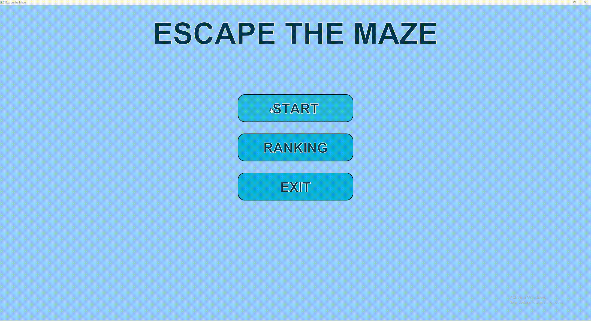
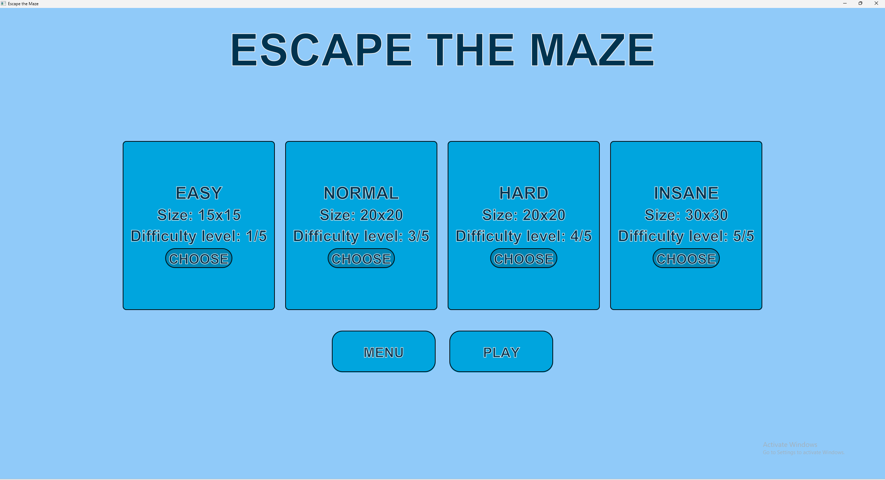

# Escape the Maze

A 2D maze game built with JavaFX featuring procedural maze generation,
multiple difficulty levels, hazards, scoring, and four different
maze generation algorithms.



## Features

- Four difficulty levels with different maze sizes and generators


- Camera-following tile renderer with keyboard movement

- Gold, spikes, freeze, fog, health, timer, and high-score systems

- Automated tests for maze connectivity and generation rules


## Maze Generation:

The game supports four procedural maze generation algorithms:

- DFS algorithm generation:
⬛⬛⬛⬜⬛⬛⬛⬛⬛⬛⬛⬛⬛⬛⬛⬛⬛⬛⬛⬛⬛
⬛⬜⬛⬜⬜⬜⬜⬜⬜⬜⬜⬜⬜⬜⬛⬜⬜⬜⬜⬜⬛
⬛⬜⬛⬛⬛⬛⬛⬛⬛⬛⬛⬛⬛⬜⬛⬛⬛⬜⬛⬜⬛
⬛⬜⬛⬜⬜⬜⬜⬜⬜⬜⬜⬜⬛⬜⬜⬜⬜⬜⬛⬜⬛
⬛⬜⬛⬜⬛⬛⬛⬛⬛⬛⬛⬜⬛⬛⬛⬛⬛⬛⬛⬜⬛
⬛⬜⬜⬜⬛⬜⬜⬜⬛⬜⬜⬜⬛⬜⬜⬜⬛⬜⬜⬜⬛
⬛⬜⬛⬛⬛⬜⬛⬜⬛⬜⬛⬜⬛⬜⬛⬜⬛⬜⬛⬛⬛
⬛⬜⬜⬜⬛⬜⬛⬜⬜⬜⬛⬜⬛⬜⬛⬜⬛⬜⬜⬜⬛
⬛⬜⬛⬛⬛⬜⬛⬛⬛⬛⬛⬛⬛⬜⬛⬜⬛⬛⬛⬜⬛
⬛⬜⬛⬜⬜⬜⬛⬜⬜⬜⬜⬜⬜⬜⬛⬜⬜⬜⬛⬜⬛
⬛⬛⬛⬜⬛⬜⬛⬜⬛⬛⬛⬛⬛⬛⬛⬜⬛⬛⬛⬜⬛
⬛⬜⬜⬜⬛⬜⬛⬜⬜⬜⬛⬜⬜⬜⬛⬜⬜⬜⬛⬜⬛
⬛⬜⬛⬛⬛⬜⬛⬛⬛⬜⬛⬜⬛⬜⬛⬛⬛⬜⬛⬜⬛
⬛⬜⬛⬜⬜⬜⬛⬜⬜⬜⬛⬜⬛⬜⬜⬜⬛⬜⬜⬜⬛
⬛⬜⬛⬛⬛⬜⬛⬜⬛⬛⬛⬜⬛⬛⬛⬜⬛⬛⬛⬛⬛
⬛⬜⬜⬜⬛⬜⬛⬜⬜⬜⬛⬜⬜⬜⬛⬜⬜⬜⬜⬜⬛
⬛⬜⬛⬜⬛⬛⬛⬛⬛⬜⬛⬛⬛⬛⬛⬜⬛⬛⬛⬜⬛
⬛⬜⬛⬜⬜⬜⬜⬜⬜⬜⬛⬜⬜⬜⬛⬜⬜⬜⬛⬜⬛
⬛⬜⬛⬛⬛⬛⬛⬛⬛⬛⬛⬜⬛⬜⬛⬛⬛⬛⬛⬜⬛
⬛⬜⬜⬜⬜⬜⬜⬜⬜⬜⬜⬜⬛⬜⬜⬜⬜⬜⬜⬜⬛
⬛⬛⬛⬛⬛⬛⬛⬛⬛⬛⬛⬛⬛⬛⬛⬛⬛⬜⬛⬛⬛

- Prim's algorithm:
⬛⬜⬛⬛⬛⬛⬛⬛⬛⬛⬛⬛⬛⬛⬛⬛⬛⬛⬛⬛⬛
⬛⬜⬜⬜⬜⬜⬜⬜⬜⬜⬜⬜⬜⬜⬛⬜⬛⬜⬛⬜⬛
⬛⬜⬛⬜⬛⬜⬛⬛⬛⬛⬛⬛⬛⬛⬛⬜⬛⬜⬛⬜⬛
⬛⬜⬛⬜⬛⬜⬜⬜⬜⬜⬜⬜⬛⬜⬜⬜⬜⬜⬛⬜⬛
⬛⬜⬛⬛⬛⬛⬛⬜⬛⬜⬛⬛⬛⬜⬛⬛⬛⬛⬛⬜⬛
⬛⬜⬜⬜⬛⬜⬛⬜⬛⬜⬜⬜⬜⬜⬜⬜⬜⬜⬜⬜⬛
⬛⬜⬛⬛⬛⬜⬛⬛⬛⬛⬛⬛⬛⬜⬛⬜⬛⬛⬛⬜⬛
⬛⬜⬜⬜⬜⬜⬜⬜⬜⬜⬛⬜⬛⬜⬛⬜⬛⬜⬜⬜⬛
⬛⬜⬛⬛⬛⬜⬛⬛⬛⬜⬛⬜⬛⬛⬛⬜⬛⬜⬛⬜⬛
⬛⬜⬛⬜⬜⬜⬛⬜⬛⬜⬜⬜⬜⬜⬛⬜⬛⬜⬛⬜⬛
⬛⬛⬛⬜⬛⬛⬛⬜⬛⬛⬛⬜⬛⬛⬛⬜⬛⬜⬛⬛⬛
⬛⬜⬛⬜⬜⬜⬜⬜⬜⬜⬛⬜⬛⬜⬛⬜⬛⬜⬜⬜⬛
⬛⬜⬛⬜⬛⬜⬛⬛⬛⬛⬛⬛⬛⬜⬛⬛⬛⬛⬛⬛⬛
⬛⬜⬜⬜⬛⬜⬜⬜⬜⬜⬛⬜⬛⬜⬛⬜⬜⬜⬜⬜⬛
⬛⬜⬛⬛⬛⬛⬛⬜⬛⬛⬛⬜⬛⬜⬛⬜⬛⬛⬛⬛⬛
⬛⬜⬜⬜⬛⬜⬜⬜⬜⬜⬜⬜⬜⬜⬜⬜⬜⬜⬛⬜⬛
⬛⬛⬛⬛⬛⬜⬛⬜⬛⬛⬛⬛⬛⬜⬛⬛⬛⬜⬛⬜⬛
⬛⬜⬛⬜⬜⬜⬛⬜⬜⬜⬛⬜⬜⬜⬜⬜⬛⬜⬜⬜⬛
⬛⬜⬛⬛⬛⬜⬛⬜⬛⬛⬛⬛⬛⬛⬛⬜⬛⬛⬛⬛⬛
⬛⬜⬜⬜⬜⬜⬛⬜⬜⬜⬜⬜⬛⬜⬜⬜⬜⬜⬜⬜⬛
⬛⬛⬛⬛⬛⬛⬛⬛⬛⬛⬛⬛⬛⬜⬛⬛⬛⬛⬛⬛⬛

- Kruskal's algorithm:
⬛⬛⬛⬜⬛⬛⬛⬛⬛⬛⬛⬛⬛⬛⬛⬛⬛⬛⬛⬛⬛
⬛⬜⬜⬜⬛⬜⬜⬜⬜⬜⬛⬜⬜⬜⬜⬜⬜⬜⬜⬜⬛
⬛⬛⬛⬜⬛⬛⬛⬛⬛⬜⬛⬜⬛⬛⬛⬛⬛⬜⬛⬜⬛
⬛⬜⬛⬜⬛⬜⬜⬜⬜⬜⬛⬜⬜⬜⬛⬜⬛⬜⬛⬜⬛
⬛⬜⬛⬜⬛⬛⬛⬛⬛⬜⬛⬛⬛⬜⬛⬜⬛⬜⬛⬜⬛
⬛⬜⬜⬜⬜⬜⬛⬜⬜⬜⬜⬜⬛⬜⬜⬜⬛⬜⬛⬜⬛
⬛⬜⬛⬛⬛⬜⬛⬛⬛⬜⬛⬛⬛⬜⬛⬛⬛⬛⬛⬛⬛
⬛⬜⬛⬜⬜⬜⬛⬜⬜⬜⬛⬜⬛⬜⬜⬜⬜⬜⬜⬜⬛
⬛⬛⬛⬛⬛⬜⬛⬜⬛⬛⬛⬜⬛⬛⬛⬜⬛⬛⬛⬛⬛
⬛⬜⬛⬜⬜⬜⬛⬜⬜⬜⬛⬜⬛⬜⬜⬜⬛⬜⬜⬜⬛
⬛⬜⬛⬜⬛⬛⬛⬛⬛⬜⬛⬜⬛⬜⬛⬛⬛⬜⬛⬛⬛
⬛⬜⬜⬜⬜⬜⬛⬜⬜⬜⬜⬜⬛⬜⬜⬜⬛⬜⬜⬜⬛
⬛⬜⬛⬛⬛⬛⬛⬜⬛⬛⬛⬛⬛⬜⬛⬛⬛⬛⬛⬜⬛
⬛⬜⬜⬜⬜⬜⬜⬜⬜⬜⬜⬜⬛⬜⬜⬜⬛⬜⬜⬜⬛
⬛⬛⬛⬛⬛⬛⬛⬜⬛⬛⬛⬜⬛⬜⬛⬛⬛⬛⬛⬜⬛
⬛⬜⬜⬜⬛⬜⬜⬜⬛⬜⬛⬜⬜⬜⬛⬜⬜⬜⬜⬜⬛
⬛⬛⬛⬜⬛⬜⬛⬜⬛⬜⬛⬜⬛⬛⬛⬛⬛⬛⬛⬜⬛
⬛⬜⬛⬜⬜⬜⬛⬜⬛⬜⬜⬜⬜⬜⬛⬜⬜⬜⬜⬜⬛
⬛⬜⬛⬜⬛⬜⬛⬛⬛⬜⬛⬜⬛⬛⬛⬜⬛⬛⬛⬜⬛
⬛⬜⬜⬜⬛⬜⬛⬜⬜⬜⬛⬜⬜⬜⬜⬜⬛⬜⬜⬜⬛
⬛⬛⬛⬛⬛⬛⬛⬛⬛⬛⬛⬛⬛⬛⬛⬛⬛⬛⬛⬜⬛

- Binary-tree algorithm:
⬛⬜⬛⬛⬛⬛⬛⬛⬛⬛⬛⬛⬛⬛⬛⬛⬛⬛⬛⬛⬛
⬛⬜⬜⬜⬛⬜⬜⬜⬛⬜⬛⬜⬜⬜⬛⬜⬜⬜⬛⬜⬛
⬛⬛⬛⬜⬛⬛⬛⬜⬛⬜⬛⬛⬛⬜⬛⬛⬛⬜⬛⬜⬛
⬛⬜⬜⬜⬜⬜⬜⬜⬜⬜⬛⬜⬜⬜⬜⬜⬜⬜⬛⬜⬛
⬛⬛⬛⬛⬛⬛⬛⬛⬛⬜⬛⬛⬛⬛⬛⬛⬛⬜⬛⬜⬛
⬛⬜⬛⬜⬛⬜⬛⬜⬜⬜⬜⬜⬜⬜⬜⬜⬜⬜⬜⬜⬛
⬛⬜⬛⬜⬛⬜⬛⬛⬛⬛⬛⬛⬛⬛⬛⬛⬛⬛⬛⬜⬛
⬛⬜⬛⬜⬜⬜⬛⬜⬛⬜⬛⬜⬜⬜⬜⬜⬛⬜⬛⬜⬛
⬛⬜⬛⬛⬛⬜⬛⬜⬛⬜⬛⬛⬛⬛⬛⬜⬛⬜⬛⬜⬛
⬛⬜⬜⬜⬛⬜⬜⬜⬛⬜⬛⬜⬜⬜⬜⬜⬜⬜⬛⬜⬛
⬛⬛⬛⬜⬛⬛⬛⬜⬛⬜⬛⬛⬛⬛⬛⬛⬛⬜⬛⬜⬛
⬛⬜⬜⬜⬛⬜⬜⬜⬛⬜⬛⬜⬛⬜⬛⬜⬛⬜⬜⬜⬛
⬛⬛⬛⬜⬛⬛⬛⬜⬛⬜⬛⬜⬛⬜⬛⬜⬛⬛⬛⬜⬛
⬛⬜⬜⬜⬛⬜⬛⬜⬛⬜⬜⬜⬜⬜⬜⬜⬜⬜⬛⬜⬛
⬛⬛⬛⬜⬛⬜⬛⬜⬛⬛⬛⬛⬛⬛⬛⬛⬛⬜⬛⬜⬛
⬛⬜⬜⬜⬛⬜⬛⬜⬜⬜⬜⬜⬛⬜⬛⬜⬜⬜⬛⬜⬛
⬛⬛⬛⬜⬛⬜⬛⬛⬛⬛⬛⬜⬛⬜⬛⬛⬛⬜⬛⬜⬛
⬛⬜⬜⬜⬜⬜⬛⬜⬜⬜⬛⬜⬛⬜⬜⬜⬜⬜⬜⬜⬛
⬛⬛⬛⬛⬛⬜⬛⬛⬛⬜⬛⬜⬛⬛⬛⬛⬛⬛⬛⬜⬛
⬛⬜⬜⬜⬜⬜⬜⬜⬜⬜⬜⬜⬜⬜⬜⬜⬜⬜⬜⬜⬛
⬛⬛⬛⬛⬛⬛⬛⬛⬛⬛⬛⬛⬛⬛⬛⬜⬛⬛⬛⬛⬛

### Why multiple algorithms?

Different algorithms produce different maze structures, which can affect the difficulty and playstyle of the game. Kruskal's and Prim's algorithms tend to create mazes with more open spaces and are better for more difficult levels, while DFS and Binary-tree algorithms create more linear paths.

## Architecture

The project separates game state, domain entities, maze generation,
input handling, and rendering.

```text
                    GameScreen
                        |
        +---------------+---------------+
        |               |               |
        v               v               v
 PlayerController   GameRenderer     GameState
        |               |
        v               +--------> TileRenderer
      Player                     PlayerRenderer

```text
MazeGenerator
      |
      +-- DFS
      +-- Prim
      +-- Kruskal
      +-- Binary Tree


## Tech Stack

- Java 22
- JavaFX
- Maven
- JUnit 5
- Git / GitHub

## Project Structure

```text
src/
├── main/java/
│   ├── algorithms/     # Maze generation algorithms
│   ├── entities/       # Player, maze, tiles
│   ├── game/           # Game state and game logic
│   ├── gui/            # JavaFX screens and rendering
│   └── management/     # Configuration and application management
│
└── test/java/
    ├── algorithms/     # Maze generation tests
    └── game/           # Game logic tests

## Run

From the project directory:

```bash
mvn javafx:run
```

On Windows PowerShell, first move into the folder containing `pom.xml`:

```powershell
cd C:\path\to\escape-the-maze
mvn javafx:run
```

## Testing

The project includes automated tests covering maze generation and
game-related logic.

The maze tests verify properties such as:

- Maze connectivity
- Valid generation
- Boundary constraints
- Generator-specific rules
- Random maze properties

Run all tests with:

mvn test

## Controls

| Key | Action |
|---|---|
| `W` | Move up |
| `A` | Move left |
| `S` | Move down |
| `D` | Move right |
| `Space` | Jump |

## Design Decisions

### Strategy-based maze generation

Maze generation is abstracted behind `MazeGenerator`, allowing
different algorithms to be used without changing the game logic.

### Separate game state

`GameState` contains mutable gameplay state such as player state,
score, active effects, and game status.

### Separate rendering

Rendering is separated from game entities using dedicated renderer
classes, keeping JavaFX-specific code outside the core game model.

## Future Improvements

- Add more maze generation algorithms
- Add sound effects and background music
- Add additional player abilities
- Add persistent online leaderboards
- Add configurable game settings

## Author

**Maksym Andrushchenko**
