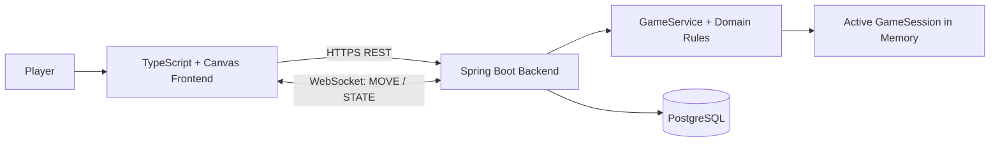

# Escape the Maze

A full-stack browser maze game with **server-authoritative gameplay**, real-time **WebSocket communication**, authentication, and a verified leaderboard.

**Java 21 · Spring Boot · TypeScript · PostgreSQL · WebSocket · Docker · Railway**

### 🎮 [Play Live](https://escape-the-maze-game-production.up.railway.app/)

> The application is deployed on Railway and runs with a Spring Boot backend, PostgreSQL database, and a Vite/TypeScript frontend served through Nginx.

---

## Gameplay


---

## Overview

**Escape the Maze** is a browser game where players create an account, choose a difficulty, navigate a procedurally generated maze, collect gold, avoid hazards, and race to the exit.

The main architectural challenge was ensuring that the browser could not decide whether a move, damage event, victory, or leaderboard score was valid.

Instead, the backend is **authoritative**.

The frontend sends player actions such as `MOVE RIGHT` to the Spring Boot server. The server validates the action against the current game state and returns the updated authoritative state over WebSocket.

Only a server-verified victory can be persisted to the leaderboard.

---

## Features

- Procedurally generated mazes with multiple difficulty levels
- Real-time gameplay using WebSocket communication
- Server-authoritative movement and game rules
- Gold, hazards, health, timer, and scoring systems
- User registration and login
- JWT-based authentication and authorization
- Persistent verified leaderboard
- Keyboard and touch controls
- Responsive Canvas-based rendering
- PostgreSQL persistence
- Versioned database migrations with Flyway
- Dockerized local development environment
- Production deployment on Railway

---

## Maze-generation algorithms

The maze is generated on the **Spring Boot backend**, not in the browser.
Each difficulty uses a server-selected generator and configuration, ensuring
that players competing in the same leaderboard category play under the same rules.

| Algorithm | How it generates the maze | Typical maze character | Current use |
|---|---|---|---|
| **Depth-First Search (DFS)** | Moves through unvisited cells and backtracks at a dead end. | Long corridors and deeper routes. | `EASY` |
| **Prim's algorithm** | Expands a randomly selected frontier wall from the carved area. | More branching and frequent choices. | `NORMAL` |
| **Kruskal's algorithm** | Removes a wall only when it joins two separate cell groups. | Varied, balanced paths without isolated areas. | `HARD` and `EXPERT` |
| **Binary Tree** | For each cell, carves one of two possible directions. | Fast, simple generation with a directional bias. | Implemented and tested; not assigned to a public difficulty yet. |

| Difficulty | Generator | Maze size | Gold / spikes / freeze / fog |
|---|---|---:|---:|
| `EASY` | DFS | 15 × 15 | 8 / 3 / 1 / 1 |
| `NORMAL` | Prim | 20 × 20 | 14 / 7 / 3 / 3 |
| `HARD` | Kruskal | 20 × 20 | 22 / 12 / 5 / 5 |
| `EXPERT` | Kruskal | 30 × 30 | 35 / 20 / 9 / 9 |

Each difficulty has a fixed generator, maze size, and hazard balance. This keeps its leaderboard comparable for every player.

---

## Architecture



The application separates **rendering** from **game authority**.

The browser is responsible for displaying the maze and collecting player input. It does not determine whether an action is valid.

For example:

```text
Player presses →
        ↓
Frontend sends MOVE RIGHT
        ↓
Spring Boot receives the command
        ↓
GameService validates the movement
        ↓
Server updates the GameSession
        ↓
Updated state is sent through WebSocket
        ↓
Canvas renders the new state
```

This prevents the client from directly manipulating important gameplay values such as health, score, position, or victory state.

### Technology stack

| Area | Technology | Responsibility |
|---|---|---|
| Frontend | Vite, TypeScript, Canvas | UI, rendering, keyboard and touch controls |
| Backend | Java 21, Spring Boot | REST API, WebSocket communication, game rules |
| Security | Spring Security, JWT, BCrypt | Authentication, protected endpoints, game ownership |
| Persistence | PostgreSQL, JPA, Flyway | Users and completed game results |
| Communication | REST + WebSocket | Application operations and real-time gameplay |
| Local infrastructure | Docker Compose | Runs the complete stack locally |
| Production | Railway, Docker, Nginx | Deployment and service networking |

More detailed technical documentation is available in the [`docs`](docs/) directory.

---

## Deployment

The application is deployed on **Railway** and is publicly accessible:

### [▶ Play Escape the Maze](https://escape-the-maze-game-production.up.railway.app/)

The production environment consists of three services:

```text
Internet
   │
   ▼
┌─────────────────────────┐
│   Frontend / Nginx      │
│   Vite + TypeScript     │
└────────────┬────────────┘
             │
        REST / WebSocket
             │
             ▼
┌─────────────────────────┐
│   Spring Boot Backend   │
│   Java 21               │
└────────────┬────────────┘
             │
             ▼
┌─────────────────────────┐
│      PostgreSQL         │
└─────────────────────────┘
```

The frontend is served through **Nginx**, which proxies API and WebSocket traffic to the Spring Boot backend.

Production configuration is supplied through environment variables. Database credentials and JWT secrets are not stored in the repository.

Flyway migrations are executed during backend startup to keep the production database schema synchronized with the application.

---

## Key Technical Decisions

| Decision | Reason |
|---|---|
| **Server-authoritative gameplay** | Prevents the browser from inventing movement, health, victory, or leaderboard results |
| **WebSocket for gameplay** | Supports frequent movement commands and immediate server state updates |
| **REST for application operations** | Fits request/response actions such as authentication, game creation, recovery, and leaderboard queries |
| **Canvas rendering** | Provides direct control over maze rendering and camera behavior in the browser |
| **PostgreSQL for durable state** | Accounts and verified results survive application restarts |
| **In-memory active games** | Avoids unnecessary database writes for every movement command |
| **JWT authentication** | Keeps the REST API stateless while protecting user-specific resources |
| **BCrypt password hashing** | Passwords are never stored as plaintext |
| **Flyway migrations** | Makes database schema changes versioned and reproducible |
| **Docker Compose** | Provides a reproducible local environment for the complete application |
| **Nginx reverse proxy** | Routes frontend API and WebSocket traffic to the backend in production |

---

## Project Evolution

Escape the Maze originally started as a **desktop JavaFX application**.

The original version focused on maze generation algorithms, game mechanics, rendering, and desktop UI development.

The project was later redesigned as a full-stack web application.

The migration required separating the original game into distinct responsibilities:

```text
JavaFX desktop application

            ↓ redesign

Browser rendering
        +
REST / WebSocket communication
        +
Server-side game authority
        +
Authentication
        +
PostgreSQL persistence
        +
Production deployment
```

Instead of simply porting the JavaFX UI to the browser, the game architecture was redesigned around a client-server model.

The web version introduced:

- Spring Boot REST API
- WebSocket-based gameplay
- JWT authentication
- PostgreSQL persistence
- Flyway database migrations
- TypeScript/Canvas frontend
- Dockerized infrastructure
- Production deployment

The original JavaFX version is available here:

**[Escape the Maze — JavaFX](https://github.com/makstuk1410/escape-the-maze-javafx-original)**

---

## Run Locally

### Prerequisites

You only need:

- [Docker Desktop](https://www.docker.com/products/docker-desktop/)
- Git

Clone the repository:

```bash
git clone https://github.com/makstuk1410/escape-the-maze.git
cd escape-the-maze
```

Start the complete application:

```bash
docker compose up --build
```

Docker Compose starts the frontend, backend, and PostgreSQL database.

### Local services

| Service | Address |
|---|---|
| Frontend | http://localhost:5173 |
| Spring Boot API | http://localhost:8080 |
| PostgreSQL | localhost:5432 |
| Health check | http://localhost:8080/api/health |

Open:

**http://localhost:5173**

to start the application.

### Stop the application

```bash
docker compose down
```

To remove the local PostgreSQL volume and start with a completely fresh database:

```bash
docker compose down -v
```

---

## Development Accounts

The development profile seeds local-only accounts after a fresh database start.

| Account | Password |
|---|---|
| `maze_tester` or `tester@escape-the-maze.local` | `TestMaze123!` |
| `leaderboard_hero` or `hero@escape-the-maze.local` | `HeroMaze123!` |

These accounts are intended only for local development and are not used in production.

---

## Documentation

The repository contains additional documentation describing the system from requirements to implementation:

- [Requirements](docs/01-requirements.md)
- [Use cases](docs/02-use-cases.md)
- [Scenarios](docs/03-scenarios.md)
- [Architecture](docs/04-architecture.md)
- [Domain model](docs/05-domain-model.md)
- [REST API design](docs/06-api-design.md)
- [WebSocket protocol](docs/07-websocket-protocol.md)
- [Database design](docs/08-database-design.md)
- [JavaFX-to-web migration plan](docs/09-migration-plan.md)

---

## Repository Structure

```text
escape-the-maze/
├── backend/
│   ├── Dockerfile
│   ├── pom.xml
│   └── src/
│
├── frontend/
│   ├── Dockerfile
│   ├── nginx.conf
│   ├── package.json
│   └── src/
│
├── docs/
│
└── docker-compose.yml
```

---

## Author

**Maksym Andrushchenko**

Software Engineering / Applied Computer Science student.

GitHub: [@makstuk1410](https://github.com/makstuk1410)
