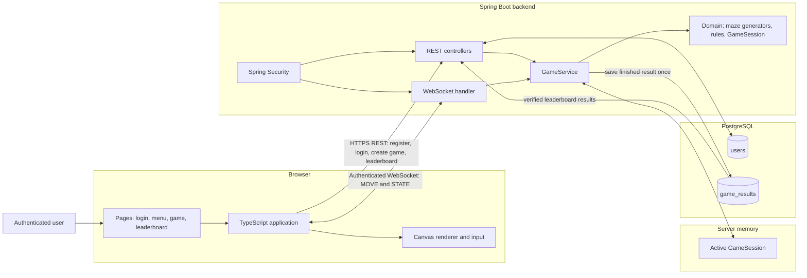

# Architecture

## Responsibilities

- **Browser:** displays Figma-based pages, captures input, and renders the
  authoritative game state in Canvas.
- **Spring Boot backend:** authenticates users, owns game rules, validates
  moves, and sends real-time state updates.
- **Server memory:** holds active `GameSession` objects while games are
  running; it is not used as permanent score storage.
- **PostgreSQL:** stores accounts and completed, server-calculated game
  results for the leaderboard.

## Trust Boundary

The browser is not trusted to decide movement validity, player health, score,
game status, or leaderboard results. Those decisions are made by `GameService`
after authentication and ownership checks.
