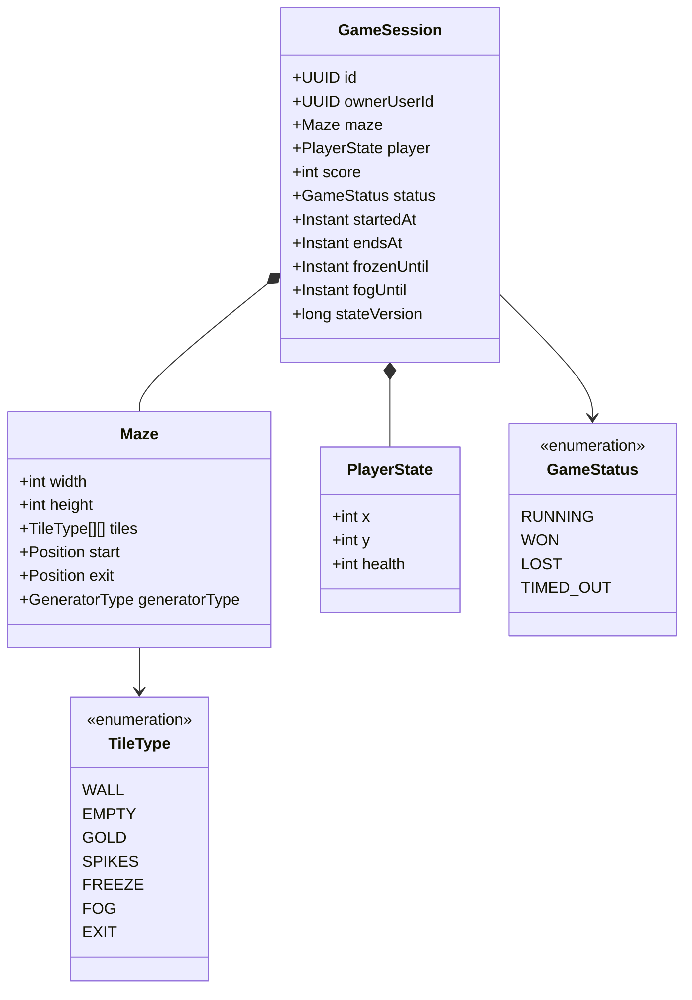

# Domain Model

The backend owns the game domain. Browser-specific values such as Canvas pixel
positions, camera offset, textures, and animations are not part of these
models.

## Maze

A `Maze` is the generated logical board for one game session.

| Field | Type | Meaning |
|---|---|---|
| `width` | integer | Number of columns in the final tile grid. |
| `height` | integer | Number of rows in the final tile grid. |
| `tiles` | `TileType[][]` | Tile grid, addressed as `tiles[y][x]`. |
| `start` | `Position` | Walkable player spawn coordinate. |
| `exit` | `Position` | Walkable exit coordinate. |
| `generatorType` | `GeneratorType` | DFS, Prim, Kruskal, or Binary Tree. |

The generator receives logical maze dimensions and produces the current
odd-sized grid (`2 × requested dimension + 1`). The maze has one entrance at
the top boundary and one exit at the bottom boundary.

## PlayerState

`PlayerState` represents the logical player, replacing the JavaFX `Player`
pixel position and animation fields.

| Field | Type | Meaning |
|---|---|---|
| `x` | integer | Current tile column. |
| `y` | integer | Current tile row. |
| `health` | integer | Remaining health points. |

The initial health is 100 in the current JavaFX rules. Health, damage, and
effect durations remain configurable game rules rather than frontend values.

## GameSession

`GameSession` is the authoritative in-memory state for one active game.

| Field | Type | Meaning |
|---|---|---|
| `id` | UUID | Unique game identifier exposed to the browser. |
| `ownerUserId` | UUID | Authenticated account allowed to access the session. |
| `maze` | `Maze` | Maze generated when the session is created. |
| `player` | `PlayerState` | Current logical player state. |
| `score` | integer | Server-calculated score. |
| `status` | `GameStatus` | Current game lifecycle state. |
| `startedAt` | instant | Time the game began. |
| `endsAt` | instant | Authoritative time limit. |
| `frozenUntil` | instant or null | End time of an active freeze effect. |
| `fogUntil` | instant or null | End time of an active fog effect. |
| `damageCooldownUntil` | instant or null | Earliest time at which spikes can damage the player again. |
| `stateVersion` | long | Monotonically increasing version for client reconciliation. |

Only a `RUNNING` session accepts movement commands. A terminal session has
status `WON`, `LOST`, or `TIMED_OUT`; its final score is persisted once as a
game result.

## TileType

`TileType` replaces Java tile implementation classes so the maze can be sent
to the browser as simple JSON values.

| Tile type | Walkable | Server-side effect |
|---|---:|---|
| `WALL` | No | Movement is rejected. |
| `EMPTY` | Yes | No effect. |
| `GOLD` | Yes | Add configured score once, then replace with `EMPTY`. |
| `SPIKES` | Yes | Apply configured damage, subject to damage-cooldown rules. |
| `FREEZE` | Yes | Set or extend `frozenUntil`. |
| `FOG` | Yes | Set or extend `fogUntil`. |
| `EXIT` | Yes | Add exit score and set status to `WON`. |

## Supporting Value Types

### Position

`Position(x, y)` is an immutable coordinate. `x` is the column, increasing
from left to right; `y` is the row, increasing from top to bottom.

### Direction

`Direction` is one of `UP`, `DOWN`, `LEFT`, or `RIGHT`. A movement command
changes a position by exactly one tile. The server checks bounds and
walkability before applying the change.

### GameStatus

| Status | Meaning |
|---|---|
| `RUNNING` | The session accepts valid movement commands. |
| `WON` | The player entered the exit tile. |
| `LOST` | The player's health reached zero. |
| `TIMED_OUT` | The server reached `endsAt` before the game finished. |
