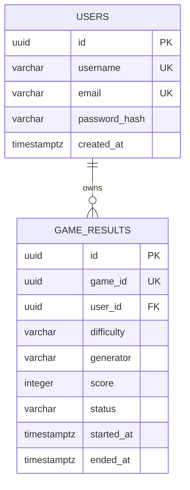

# Database Design

PostgreSQL stores durable account and completed-game data. Active
`GameSession` objects remain in backend memory during gameplay and are not
written for every movement.



## users

Stores authenticated player accounts.

| Column | Type | Constraints | Description |
|---|---|---|---|
| `id` | `UUID` | Primary key, not null | Unique user identifier. |
| `username` | `VARCHAR(50)` | Not null, unique | Public leaderboard name. |
| `email` | `VARCHAR(255)` | Not null, unique | Login/account email. |
| `password_hash` | `VARCHAR(255)` | Not null | Secure one-way password hash. |
| `created_at` | `TIMESTAMPTZ` | Not null | Account creation time in UTC. |

Rules:

- `username` and `email` are unique after normalization.
- Plain-text passwords, access tokens, and game-session state are never stored
  in this table.

## game_results

Stores exactly one durable result for each completed game.

| Column | Type | Constraints | Description |
|---|---|---|---|
| `id` | `UUID` | Primary key, not null | Unique result identifier. |
| `game_id` | `UUID` | Not null, unique | Source `GameSession` identifier. |
| `user_id` | `UUID` | Not null, foreign key to `users.id` | Owner of the completed game. |
| `difficulty` | `VARCHAR(32)` | Not null, check `difficulty IN ('EASY', 'NORMAL', 'HARD', 'EXPERT')` | Chosen leaderboard category. |
| `generator` | `VARCHAR(32)` | Not null | Maze generator identifier. |
| `score` | `INTEGER` | Not null, check `score >= 0` | Server-calculated final score. |
| `status` | `VARCHAR(32)` | Not null | `WON`, `LOST`, or `TIMED_OUT`. |
| `started_at` | `TIMESTAMPTZ` | Not null | Game start time in UTC. |
| `ended_at` | `TIMESTAMPTZ` | Not null | Completion time in UTC. |

Rules:

- `user_id` references `users.id`; one user can own many game results.
- `game_id` is unique so duplicate completion events cannot create duplicate
  results.
- `difficulty` must be exactly one of `EASY`, `NORMAL`, `HARD`, or `EXPERT`.
  Results are ranked only with other results of the same difficulty.
- Only terminal statuses (`WON`, `LOST`, `TIMED_OUT`) may be saved.
- The backend, not the browser, writes scores and results.

## Relationships

```text
users (1) ────< game_results (many)
```

Each `game_results.user_id` belongs to one account. Deleting users is outside
the MVP scope; production policy should preserve leaderboard integrity through
an account-deactivation strategy rather than cascading deletion of results.

## Indexes

| Index | Purpose |
|---|---|
| Unique index on `users.username` | Prevent duplicate public usernames. |
| Unique index on `users.email` | Prevent duplicate account emails. |
| Unique index on `game_results.game_id` | Enforce one persisted result per game. |
| Index on `game_results(user_id, ended_at DESC)` | Retrieve a user's recent completed games. |
| Index on `game_results(difficulty, score DESC, ended_at ASC)` | Retrieve a difficulty-specific leaderboard efficiently. |

## Migration Policy

Schema changes must be created as versioned Flyway migrations. The first
migration creates `users`, then `game_results`, foreign-key constraints, check
constraints, and the required indexes.
